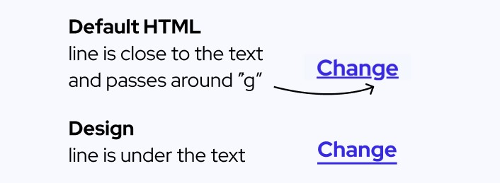

# Frontend Mentor - Order summary card solution

This is my attempt to solve the challenge: [Order summary card challenge on Frontend Mentor](https://www.frontendmentor.io/challenges/order-summary-component-QlPmajDUj).

**Solution Links**

- [Code on GitHub](https://github.com/joe-chelladurai/frontend-mentor/tree/main/newbie/order-summary-component)
- [Live Site](https://joe-chelladurai.github.io/frontend-mentor/newbie/order-summary-component/)

## What I learned

### Setting the underline below text

The design file's link has the underline below the text! The default anchor tag did this. Notice that the line is closer to the text and the `g` letter was avoided. I probably wouldn't have noticed this if the letter `g` wasn't in the text.



This was a fun discovery in the end: https://developer.mozilla.org/en-US/docs/Web/CSS/text-underline-position

```css
text-underline-position: under;
```

### Using the grid to align the price card

My inital attempts at flexbox didn't help me align the text elements in the price card. I tried `flex-basis` with flexbox but I couldn't get it right. I tried `grid-template-columns` with grid and it was so much easier.

```css
.card {
    display: grid;
    grid-template-columns: 1fr 2fr 1fr;
    align-items: center;
    padding: 1em;
    grid-gap: 1em;
```

### Setting the Background Image

After I finished everything, I noticed that there were background image files in the folder. Vscode autocomplete helped me with this, I don't like googling because it is distracting and takes a few decisions like deciding what keywords to type, which links to click, going through different explanations, and trying to understand information. Sometimes googling is very quick, but if I memorize then I don't have to google. Autocomplete is a more realistic option.

```css
background-image: url("./images/pattern-background-mobile.svg");
background-repeat: no-repeat;
```

### Learning to see box shadows

This is new to me. My solution isn't accurate but close in some ways.

```css
box-shadow: rgba(149, 157, 165, 0.75) 0px 8px 24px;
```

I got this above box-shadow code from https://getcssscan.com/css-box-shadow-examples #0

### Getting comfortable with media queries

I was hesitant to go mobile-first. I'm learning that expanding from mobile to desktop is easier, particularly for this solution.

```css
@media (min-width: 375px) {
  body {
    background-image: url("./images/pattern-background-desktop.svg");
    background-repeat: no-repeat;
    background-size: contain;
  }
  main {
    width: 28.125rem;
  }
  .content {
    padding: 0 3em 3em;
  }

  .card {
    padding: 1.5em;
  }

  .heading {
    font-size: 28px;
  }
}
```

### Continued development

I need to track how long this took. I think this took about 2 - 3 hours of focused work. I used to think that I should use grid only for large layouts, but working on the pricing section was so much easier with grid.

### Useful resources

- [Box Shadow](https://getcssscan.com/css-box-shadow-examples) #0 - This helped me get box shadows.

### Solution Links

- [Code on GitHub](https://github.com/joe-chelladurai/frontend-mentor/tree/main/newbie/order-summary-component)
- [Live Site](https://joe-chelladurai.github.io/frontend-mentor/newbie/order-summary-component/)

## Author

- Website - [Joe Chelladurai](https://joechelladurai.com)
- Frontend Mentor Solutions - [Live Site](https://joe-chelladurai.github.io/frontend-mentor/)
- Frontend Mentor Code - [Code](https://github.com/joe-chelladurai/frontend-mentor)
- Frontend Mentor - [@meshach-joe](https://www.frontendmentor.io/profile/meshach-joe)
- Twitter - [@joe_chelladurai](https://twitter.com/joe_chelladurai)

## Acknowledgments

Frontend mentor community solutions were helpful.
